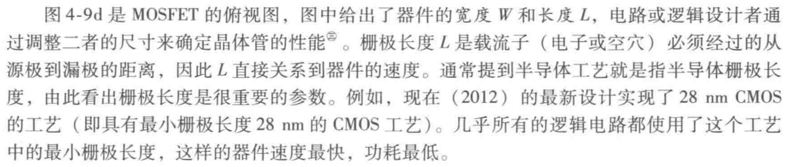
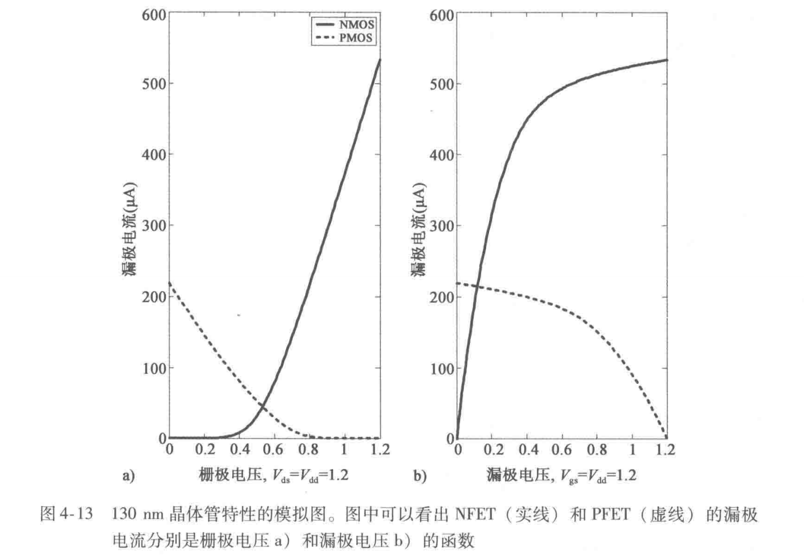
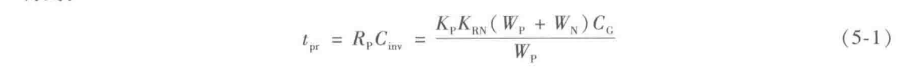
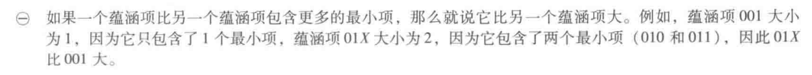
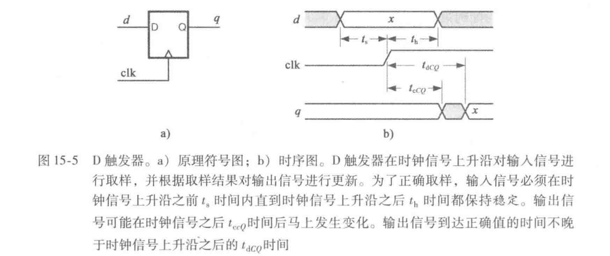

William.J.Dally\&R.Curtis Harting
剑桥大学出版社/机械工业出版社
老子花2块大洋从tb找的电子版（直到有一天老子发现了FreeMbook）

0712

# 第1章：数字抽象化

数字系统有别于模拟系统之处在于它们可以处理、传输、存储信息而不因噪声失真（原因：离散性）

缓冲器将信号恢复为原始0/1，并消除附加噪声

噪声容限与（逻辑电压）摆幅之比V\_NM/(V1-V0)

所有模块的传递曲线（传输特性曲线）必须位于阴影范围之内


可见，恢复逻辑模块必然是可提供增益的有源元件

程序设计语言通常是按顺序（步进）执行的，而硬件描述语言中所有的模块以及每个模块中的赋值语句都是活动的，所有的语句始终被执行

每个模块实例化后都是添加硬件模块，每条赋值语句都是在模块的每个实例添加门电路

硬件描述语言的抽象化也可能使设计者与最终产品脱钩，导致产生效率低的设计

为节省计算资源（面积和能量），计算要求最高的功能直接在逻辑中实现（具有固定功能的逻辑块）而非在处理器中运行的软件上实现

现代电子系统的组成：模拟前端、处理器、固定功能的数字逻辑、存储器，总线和网络使这些分支系统得以互联

0719

# 第2章：数字系统设计实践

~~这就开始实践？~~

暂时不是很想记这一章的东西

设计流程、实现技术、CAD、工艺规模

#### 设计流程


0720

#### 实现技术

-   [ ] to be filled

#### CAD


#### 数字系统的演变

集成电路上的元器件数正以0.5倍/年的速度增长，大约每五年增加一个数量级


#### 本章小结


# 第3章：布尔代数

已学知识先略去，部分可予以注意的知识如对偶函数及某些运算律暂且略过不看

#### 用Verilog描述布尔表达式

实现a(b+c)的模块定义如下

```verilog
module AND_OR(a,b,c,y);//声明了具有a,b,c,y四个引脚的AND_OR模块
  input a,b,c;
  output y;
  assign y=a&(b|c);//assign 表示是组合逻辑函数
 endmodule
```

一个简单的testbench写法如下

```verilog
`timescale 1ns/1ps//这个“`”是键盘左上角Esc下方的，英文模式输入
`include "AND_OR.v"
module test_AND_OR;
  reg[2:0] cnt;//用于发生三位二进制输入
  wire y_out;
//实例化门
  AND_OR a(cnt[2],cnt[1],cnt[0],y_out);
//initial begin后的代码只会执行一次
  initial begin
    //Verilog以缩进取代大括号
    //=====生成波形=====
    $dumpfile("wave.vcd"); //生成的 vcd 文件名称 
    $dumpvars(0, test_AND_OR); //第二个参数为 tb 模块名称
    //=================
    cnt=3'b000;
    repeat (8) begin
      #100
      $display("IN=%b,OUT=%b",cnt,y_out);//%b是二进制输出格式符
      cnt+=1;
    end
  end
endmodule

```

运行后输出

```verilog
[Running] AND_OR_tb.v
IN=000,OUT=0
IN=001,OUT=0
IN=010,OUT=0
IN=011,OUT=0
IN=100,OUT=0
IN=101,OUT=1
IN=110,OUT=1
IN=111,OUT=1
[Done] exit with code=0 in 0.106 seconds
```

注意vcd要点击Add Signals里面，选择了变量才看得见波形


#### 独热码

来自习题3.29(a)的一瞥，指的是有多少状态就有多少位编码，一个状态下只有一位是1其它全0

比如A,B,C三个状态分别编码为001,010,100

#### 用VSCode写Verilog

网上随缘搜的，懒得额外装软件了，反正没FPGA

<https://zhuanlan.zhihu.com/p/593091162?utm_id=0>

# 第4章：CMOS逻辑电路

**回顾：** 使用互补的一对MOS，NMOS部分（下拉部分）写出来是啥，逻辑函数的反就是啥；至于PMOS的栅极，接的都是直接输入变量的反（当直接输入变量本身是反的时候，接的才是正）

也即此图


注意上面f(a,b,c)尽管确实是要表达的逻辑函数但是形式通常发生了变化而不那么直接（如与→非或非；与非→非或），且因为PMOS栅极带圈，栅极实际输入都是反相后的abc

#### 串-并联网络

见例4-1，有如卡诺图的机器化简（Q-M法）

#### MOS管结构




#### MOS管开关的等效电路

**回顾**：对于NMOS，当栅极为逻辑1且源极为逻辑0时，开关闭合，NMOS导通；其他情况，NMOS均截止（栅源均1时为未定义状态，只能传0不能传1）


\*平方也即平方米


以上部分只做参考即可，毕竟最先进工艺已经远超此水平了

祭出此图


与下图对照，不言而喻，一目了然



0728

#### 单调逻辑函数

输入端一个方向上的跳变引起输出端只在一个方向上的跳变，称为单调逻辑函数

单调递减逻辑函数是输入/输出端跳变方向相反的逻辑函数，又称反相逻辑函数。单个静态CMOS门电路只能产生反相逻辑函数

#### 圆圈规则

尽量使输出端带圈的门电路的输出是输入端带圈的门的输入，即“从圈到圈”

#### 对偶函数

参见：本书3.3节

一个逻辑函数的对偶函数是“1、0互换，与、或互换，取反不动”，若其函数式中各变量取自身的补，则对偶函数的函数值就是原函数的补。特别地，若一个函数的对偶函数是其本身（比如择多函数），则其上拉、下拉部分可用相同结构实现（原因可参见图4-15），而不必手动再取对偶式的形式

> **注意高低电平与逻辑真假的对应关系是研究的一个前提**，比如P50上端分析择多函数的例子

> **注意能否直接得到反相输入**

#### 实例：3输入异或门

其逻辑函数可简记为：当奇数个输入为高电平时，输出高电平


#### 三态电路

三种输出状态：0，1，z

> Verilog中，未连接任何驱动的线可以用符号z表示

三态反相器的输出不是输入的可恢复逻辑函数

本书图4-25的三态门多路选择器采用了未加OD结构的线与结构，不是一个良好设计，然而本质上它就是一个总线结构

慎用三态门以确保使能信号不重叠（以免烧管子）：加入空闲周期；用足够长的时延弥补时钟偏斜（比如上升沿长时延，下降沿短时延）

#### 一些错例


b)所谓恢复是指把质量低的电压恢复到质量高的逻辑电平。b=0时传输门打开，a的电压直接传过去，没有质量上的提高。

# 第5章：CMOS电路的延迟和功耗

#### 静态CMOS门延迟

时延：在上升/下降沿均指“50%到50%”的时间

上升沿看PMOS，下降沿看NMOS，后级输入电容是该管PMOS和NMOS电容之和，即C\_inv=(W\_P+W\_N)\*C\_G，W\_x均是以8L\_min为单位的无量纲数，C\_G是宽8L\_min的门的电容，约为0.22fF。R\_P=K\_P/W\_P=K\_RP\*K\_RN/W\_P




驱动一个相同类型的反相器，其时延t\_inv取决于器件宽度

例5-1（上升时间和下降时间）：就是找出等效电阻最大的通路以及此时各晶体管的开关状态，考虑边沿所以还可以推断出各管上次的状态

#### 扇出

门的大小：用W\_N衡量，则单位大小就是W\_min，称大小为1；用W\_p衡量，则W\_p=K\_p\*W\_N，单位大小对应于K\_p

单位大小的反相器驱动四倍大小的反相器，和其驱动四个单位大小的反相器延时相同，可见门的大小是关乎“驱动力消耗”的量

扇出为k的电路延迟是扇出为1的k倍。常用4扇出电路（FO4）比较工艺优劣及作参照


求导可得最低延迟为α=e时，但扇出小于3则级数太多，大于6则延迟过长，一般取4。分级扇出能在保证驱动能力时把延迟从线性级缩为对数级

0729

#### 扇入

一个门需要几个门来驱动的问题。扇入可通过增加输入（为什么书上是输出？）电阻或等效输入电容来增加门延迟

主要目的是保持输出驱动不变，为此应保证门的上拉电阻和下拉电阻都等同于单个反相器（最坏情况下），所以看所有通路中哪种MOS管开关情况的等效上拉/下拉电阻最大，让这个电阻等于单个反相器的，就能得到管子宽度的参数（用最小宽度的倍数来衡量），据此再算出具有单位驱动的门的输入电容，其值等于PFET和NFET电容之和


**逻辑功效**：门的输入电容和具有相同驱动的反相器输入电容（也即1+K\_p）之比


#### 计算延迟

书中讨论基于28nm工艺模型，K\_p=1.3，延迟=2.3τ\_N=2.7ps


扇出就是本级的1个门驱动下级的几个门；下级的逻辑功效就看下级是几个输入的什么门，可参照表5-1

一个电路的最大延迟取其最长/关键路径的，这个路径得是时间上最长


#### 延迟优化

此小节写的如同放屁，具有国内书惯有的跳步骤和默认懂的都懂


0730

此表的计算方法：前面已经提到每一级的延迟都等于该级（对下一级）的扇出乘以下一级的逻辑功效，而扇出（电功效）就是下级门大小与本级门大小之比。据此，先算出总功效（总延迟）=（Π各级扇出） *（Π各级逻辑功效）等于257，再取级数分之一次方，即257^(1/4)≈4，把4作为每一级的延迟。由第一级扇出为x/1，第二级单个反相器的逻辑功效固然为1，应有(x/1)* 1=4，得x=4，所以扇出x/1=4。再由第二级扇出为y/x，第三级单个2输入与非门的逻辑功效固然为1.43，得(y/x)\*1.43=4，解得y=11.2，所以扇出y/x=2.80，依此类推

注：并非对于所有情况都是取TE^(1/n)最佳，可能需要取一些折中以调整级数、每级门的类型，比如加偶数个反相器扩大级数降低总延迟。把增加的电路放在最后以免影响诸级门的大小

考虑门自身的寄生电容及增加级数的成本，每级最优（电）功效是3\~4（而非e）；不要构建高扇入门，否则延迟较大

例5-5 表5-7的11.5数据和10.3数据来源不明；至于“功效”指的是逻辑功效，每级延迟也是由扇出（=下行大小/本行大小）乘以逻辑功效求得，而事实上是利用的这个原理求的大小

#### 连线延迟


注意上表线电阻/电容、面电阻的单位

最小反相器（W\_N=8\*L\_min）输出电阻为5.25kOhm，输入电容0.52fF。反相器越大，其输出电阻越小

连线很短——按集总电容建模，较大驱动门应兼考虑电阻

连线很长——连线电阻。电容随长度线性增长→连线延迟平方增长。改善办法：中继器驱动，即

分为n段，每段结束插入反相器/中继器驱动下级，总延迟是三部分之和


连线延迟是两中继器间距和各自大小的函数（懒得细看了）

#### 功耗


活动因子α：每周期中发生转换的次数，有的取α计算完整周期数（翻转再回来？）而非变化次数，则α值去半

降低动态功耗：同时降低V和f；减小电路（最小化连线长度可减小连线电容）；降低α

静态功耗：主要由漏电电流引起，可占总功耗30%，漏电电流正比于e^(-V\_T)，曲线斜率（亚阈值斜率）70mV/dec

降低静态功耗：使用高V\_T管、保持电源门控电路关闭/打开以减少两状态间循环

并行是可行的更节能的方法

能耗计算（例5-7）

0812

# 第6章：组合逻辑设计

#### 闭合

若干组合逻辑电路无闭环相连仍是组合逻辑电路

#### 蕴含项

实在是答辩




用立方体的顶点、棱和面表示蕴含项是比卡诺图还要答辩的方法


#### 覆盖

最小覆盖：对应于最简与或式

门电路化时是否最小覆盖影响其实也很小

#### 险象


二进制数对应cba

此外还可接滤波电容或引入选通脉冲来消除险象

0811

# 第7章：使用Verilog描述组合逻辑

一些Verilog编写规则

#### 描述组合逻辑


#### 利用综合器实例化逻辑门


综合工具通过约束文件对设计进行再优化时倾向于提高电路的速度而非面积

编写代码时优先选用行为描述方式可使综合器尽可能利用无关项来简化逻辑

#### 有一定位长的变量声明

```verilog
input[3:0] in;
reg[0:3] tmp;//以tmp[0]为最高有效位
```

#### 一个典型的Verilog输入/输出模块

```verilog
module <模块名>(<参数名列表>);
  <输入/输出参数声明>;
  <内部信号（wire,reg）声明>;
  <模块体>;
endmodule
```

#### wire和reg

wire是输出信号默认声明类型，用于模块之间连接或assign语句赋值。比如以下语句等价

```verilog
wire a;
assign a=(b&c)|(~b&d);
//===========================
wire a=(b&c)|(~b&d);
```

reg用于case和casex语句中被赋值

#### case和casex

case——必须是强的枚举，即最小项

casex——允许枚举中出现蕴含项（无关状态），比如

```verilog
//..
  input[2:0] in;
  output mod4;
  always @(in) begin
    casex(in)
      4'bx00:mod4=0;
      default:mod4=1;
    endcase//不是endcasex
  end
//..
```

#### 描述组合逻辑的方法

**行为描述**

①直接的行为描述，如10以内素数电路输入2,3,5,7输出真，其余输出假；

②最简与或式行为描述：基于casex语句；

③真值表式行为描述：基于assign语句

**结构描述**

实例化逻辑门，不同的是可以避免实例化XOR12这样具体的门，而使用Verilog封装的门函数

```verilog
//比如wire a=(b&c)|(~b&d);用结构描述的方法为
//f.v——模块名与文件名一致
module f(a,b,c,d);
  input b,c,d;
  output a;
  wire b_and_c,nb_and_d;
  
  and and1(b_and_c,b,c);
  and and2(nb_and_d,~b,d);
  or or1(a,b_and_c,nb_and_d);
endmodule
```

#### 编写测试平台（testbench）

测试平台本质上仍是.v文件，但不被综合，不占用芯片面积。注意，测试平台中的initial、repeat、#10（延时）在综合时都是不允许或不建议的

```verilog
//f_tb.v
`include "f.v"//须包含源模块文件——默认在同一目录下
module f_tb;
  reg[2:0] in;
  wire a;
  
  f test_f(a,in[2],in[1],in[0]);//参数顺序须与模块定义的相同
  
  initial begin
    in=0;//给输入赋初值
    repeat(8) begin
      #10
      $display("in = %3b ; OUTPUT = %1b",in,a);
      in=in+1;
    end
  end
endmodule
```

可以将两个同一功能不同实现模块用testbench对照以验证功能的正确性


#### 定义常量

```verilog
//比如定义一个常量SI=4330
`define SI 4'd4330
//使用时
//..
  case(x)
    `SI:out=1;//注意短反撇
//..

```

#### 同时赋值


以下摘自下一章

#### 默认参数

```verilog
//独热码发生器
module Dec(a,b);
//定义默认参数n=2,m=4
  parameter n=2;
  parameter m=4;
  
  input[n-1:0] a;
  output[m-1:0] b;
  
  assign b=1<<a;
endmodule

//实例化时
Dec dec_2_4(a1,b1);
Dec #(3,8) dec_3_7(a2,b2);//使用非默认的参数定义3位输入8位输出的独热码发生器
```

#### 信号复制扩长

k{y}是将y复制k次成一个四位的二进制数

#### 缩减运算符


比如用缩减运算符比较两个二进制数是否相等：

```verilog
wire eq=&(a~^b)//~^是同或，也就是异或^的反
```

# 第8章：组合电路基础单元

译码器、编码器→优先编码器、多路选择器→数据选择器、仲裁器、移位器、比较器、RAM、ROM、PLA

#### 预译码

什么东西，讲的又绕又抽象


拆分成低扇入系数的门是为了减少逻辑功效

我真的会谢，写的是什么狗屎

线径大概是=预译码器个数*单个预译码器的输出线数=(整个译码器输入数n/单个预译码器输入线数i)* 单个预译码器的输出线数2^i

因为每个预译码器的输出都有且仅有一条线连到后端的每一个与门，所以后端扇入自然为n/i


这么做的道理是它把0\~63都化成3位四进制数(xyz)\_4，这样0\~15的x都是0，48\~63的x都是3

一个**不太自然**的想法


4{y\[0]}是将y\[0]复制4次成一个四位的二进制数

#### 实现多路选择器

多路选择器是扩展版的数据选择器——可以选择**一路**信号


b)的好处是利于布线，缓冲器可放于数据源附近且不需那么多扇入的或门


注意：这里选择信号是**独热**编码，这正是大多数标准单元库中的设定：基本多路选择器的选通端是**独热编码**的。此外，编码器**只有**输入独热编码才能正常工作

**选通端为二进制编码的多路选择器**


多路选择器可用于实现n输入单输出的组合逻辑，~~因逻辑函数的最简与或式至多含有2^(n-1)项，故可将逻辑函数按某一位分解成f=f\_1(D\_i,~~ \~\~**D\_其余的****D\_其余的**\~\~\~\~)\~\~因n输入逻辑函数总能写为数据选择器的标准形式Σlogic(D\_n(A\_n-1·A\_n-2·...·A\_0))，故只需一个2^(n-1)输入的多路选择器就行


#### 树形结构

包括大型译码器、大型编码器、大型多路选择器，忘了就回去看书罢

#### 仲裁器

寻找值为1的最低二进制位，其逆向使用是寻找值为1的最高二进制位。可用于二进制数对齐、总线占用控制、优先编码器构建

实现方法：

①基于迭代电路


一级级地级联，故而后级需等前级先算完，否则输出是无效的，这带来比较长的延迟

②基于超前技术


**Verilog实现**


Arb道理是c\[0]始终为1，c\[i]=(\~r\[i-1])\&c\[i-1]，c\[i-1]为0则已经找到最低位1了（因而后面c\[i+1]等等也迭代地全都是0），为1则还没找到。c是用{}得到的信号组合，见第7章

这都怎么想出来的


可编程优先级仲裁器：把r复制一份到左边再从输入所设定的优先级最高那位开始用Arb（见P120\~121例8-3）

#### 数值比较

有MSB优先和LSB优先两种方式，LSB优先方式的思想不自然……用行为描述会方便些

0812

#### 移位

桶形移位——循环的；漏斗移位——截取的

比如，桶形移位的循环性决定位长为N的数据a最多左移(N-1)位，如此，若将a扩展到2N长（如101→000101），则a的最高位至多左移到2N-2下标处（010100），即扩展并移位后2N-1下标处的数据只可能是0；要实现循环需把101两侧的0抠除，而这只需把扩展并移位后的数据等分再按位或，即(010)|(100)——如此则不难理解桶形移位器的Verilog描述


#### ROM

把它放在组合逻辑里……

位线——n输入的逻辑函数位线有2^n条；

字线——数目等于输出位宽度的数目

二维存储阵列结构：先选一行字，再选一个字，正方形阵列往往使布局最有效，因其可最大限度减少外设（译码器、Mux）的开销

用case实现ROM非常笨重，可利用文件对ROM初始化：


2\*\*w-1表示2的w次方减1；\$readmemh语句将数据从文件中加载到一组reg变量

当ROM尺寸大于几千字节的临界值时，宜采取定制而非综合成逻辑模块的方式

PLA含与平面和或平面，很多行在同一时间都可处于高电平，与译码器的“独热”特性不同

#### 数据手册


**约束文件**


# 第9章：组合电路实例（留坑）
0910

# 第10章：算术电路

#### 二进制数、全加器与二进制加法
没啥好记的

#### 补码、负数和减法
原码（符号-数值码）、反码（1的补码）、补码（2的补码）
前两者中，+0和-0没有统一的表示，这不仅带来麻烦，更使减法运算变得困难
![[Pasted image 20230910212538.png]]
![[Pasted image 20230910212631.png]]
从图上理解，某数-x等效于该数绕圆逆时针转x，即等效于该数绕圆顺时针转(16-x)，而这正是该数加(16-x)后模16
由减法器，只需在算出结果后加个“过零比较器”，就足以实现两个加数比大小的功能
>注意对齐与符号扩展：软件中，用(n-m+1){b[m-1]}这样的形式；硬件中，只需将符号位重复连线
>补码移位时，右移应注意复制符号位，左移需注意溢出
>小数部分的补码规则和整数部分一样，整数小数部分分开取补码再运算。这样做的道理是可以把小数加法拆分为整数部分和小数部分分别作加法，再将结果汇总也即加起来

#### 溢出检测
没细看
在和的长度等同于两加数中较长者时，溢出可根据下列准则判断：两加数符号位相同，且**到符号位**的进位信号和符号位不同的时候，溢出发生。如果和的长度已经取得足够长（比如故意把N位全加器的资源只用较低的N-1位），当然也就避免溢出了
![[Pasted image 20230910213923.png]]
>子曰：要节约硬件资源，避免结构单元不被很好地综合![[Pasted image 20230910214140.png]]

#### 乘法
![[Pasted image 20230910215743.png]]
![[Pasted image 20230910215912.png]]
![[Pasted image 20230910220008.png]]
#### 除法
![[Pasted image 20230910221118.png]]
上面的分析只作备忘录，看图即可
![[Pasted image 20230910221157.png]]
![[Pasted image 20230910221241.png]]
![[Pasted image 20230910221307.png]]
0911
# 第11章：定点数与浮点数
#### 分辨率、准度和精度
分辨率：可分辨的最小间隔，即LSB所对应的数
准度和精度：
![[Pasted image 20230911113711.png]]
以相对精度表示时，浮点数效率更高；以绝对精度表示时，定点数效率更高

#### 定点数
sp.f数制：1为符号位（s）+p位整数位（p）+f位小数位
![[Pasted image 20230911114120.png]]
![[Pasted image 20230911114206.png]]
显然，将十进制小数向二进制小数转换可能带来误差（主因是5并非2的整数次幂）
二进制小数的舍入与舍去：被舍部分的最高位为1，则舍入（向上）；为0，则舍去（向下）

#### 定点数运算
加法：4.f+4.f→8.f（实际未必取这么宽，但溢出总发生在高位故至少取为5.f
s4.6+s4.6→s8.6（实际未必取这么宽，但溢出总发生在高位故至少取为s5.6；为防止溢出，过程中用s8.6形式进行求和，再将结果转回s4.6格式，若结果超出可表示的范围则将该值固定到所能表示的最大值
如果小数位数不一样，跟从位数长的统一扩充
乘法：
![[Pasted image 20230911115242.png]]

#### 浮点数
浮点数可看作二进制的科学计数法，由指数e（也称阶码）和尾数m组成，其形式具有允许m中二进制小数点位置浮动的效果，故得名。一个十进制的小数v可表示为v=m×2^(e-x)，可以记作mE(e-x)，其中m是一个二进制小数（**小数点在m的MSB的左边**），e是指数，x为偏移量，用于居中动态范围。如果把m和e都用二进制形式（m_k-1m_k-2……m_0）2这样来表示， 则v又可以写作
![[Pasted image 20230911135701.png]]
通常用规格化的形式表示浮点数，使尾数的MSB总为1（除非指数为0）（常省略它，称为**隐含的1**。比如10010E011而不是01001E100。按8位存储时，指数在左而底数在右，如01110010。若加入符号，符号应在最左边
逐级下溢：**仅允许**指数为0时，未规格化数可以减少由于下溢引起的误差（当算术运算结果比该数制可表示的最小数更接近0时，出现该数制下相对误差较大的情形），比如在4E3（数制，不是4×2^3）中将1/8表示为0010E000而不是表示成0.5（1000E000）
规格化的好处之一是便于控制误差精度同时节省位数。若要求相对误差，则浮点表示比定点表示通常位数更少，且适应范围更广
![[Pasted image 20230911140452.png]]

#### 浮点数运算
乘法：尾数相乘，指数相加，如输入有偏移，因两个乘数都有同样偏移，而结果仍需表示为带偏移的形式，故需再减一次偏移。因乘法将带来尾数翻倍，为使得数的数制与乘数相同，需：①对得数的尾数进行舍入操作；②再专门调整指数
![[Pasted image 20230911205726.png]]
为什么如果xm[4]为1则xm[0]保证为0？
加减法：对齐（涉及移位操作，右移指数较小的加数的尾数，将小数点对齐到高指数）、相加和规格化（规格化中可能需要舍入；由于加法得数最多只会多一个最高位，而减法得数最小会到0，故结构最高有效位可能需要**右移**至多1位或**左移**至多整个长度的位来适应这个数制）
![[Pasted image 20230911211022.png]]
![[Pasted image 20230911211108.png]]

0912
# 第12章：快速算术电路

讲的如同狗屎，我设计你妈数字啊，明天你就滚蛋
#### 超前进位
将进位信号分为传递信号和生成信号（参见P151）。传递信号是用于传递的和，当传递信号为真（如这一位的全加器两加数输入位为一个0一个1？？）时，该位的进位输入将被透明地传递到该位的进位输出——也就是说，传递信号是指示传递**是否可以**发生的。生成信号是新增的进位信号，当生成信号为真（比如这一位全加器两加数输入位都是1）时，无论该位进位输入是什么，都在此位生成一个进位信号
超前进位是用递归的办法把行波进位的延迟（正比于加法器的位数）缩小到对数级的一种设计
这部分没看太懂，留坑待日后填上：
![[Pasted image 20230912221009.png]]
![[Pasted image 20230912221044.png]]
![[Pasted image 20230912221117.png]]
![[Pasted image 20230912221139.png]]
![[Pasted image 20230912221200.png]]
![[Pasted image 20230912221222.png]]

#### 布斯编码
![[Pasted image 20230912225146.png]]
![[Pasted image 20230912231927.png]]
![[Pasted image 20230912225302.png]]
![[Pasted image 20230912225330.png]]
#### 华莱士树
![[shushenmsl.png]]
0913
![[Pasted image 20230913010137.png]]
![[Pasted image 20230913010206.png]]
![[Pasted image 20230913010238.png]]
![[Pasted image 20230913010312.png]]
![[Pasted image 20230913010327.png]]
# 第13章：算术运算实例（留坑）
0813

# 第14章：时序逻辑

研究同步时序电路，即FSM

**【回顾】**


#### 状态分配


通过优化状态分配以尽可能节省门电路并非研究重点

#### 状态方程

比硬扯门电路的方法（原书图14-10）要快且省事

#### Verilog实现FSM

①以实例化的状态寄存器存储状态变量的各位

②用常量定义输入、输出、状态编码及其位数，以方便维护且增加可读性

③为FSM设定复位信号

拿十字平交窄路口的红绿灯状态逻辑（图14-8）为例


应预先定义好基于D触发器原理的状态寄存器&#x20;

```verilog
module DFF(clk,in,out);
  parameter n=1;//状态寄存器的位数
  input clk;
  input[n-1:0] in;
  output[n-1:0] out;
  reg[n-1:0] out;
  
  always @(posedge clk)begin//posedge表示上升沿，negedge表示下降沿
    out=in;
  end
endmodule

```

再对FSM（包含其中的常量）定义，期间实例化上述状态寄存器

```verilog
`include "DFF.v" 
//定义常量，用2位二进制数编码状态
`define WIDTH 2
`define GNS 2'b00
`define YNS 2'b01
`define GEW 2'b10
`define YEW 2'b11
`define GNS_OUT 6'b100001
`define YNS_OUT 6'b010001
`define GEW_OUT 6'b001100
`define YEW_OUT 6'b001010

//FSM
module TL_FSM(clk,rst,carew,TL_output);
  input clk,rst,carew;
  output[5:0] TL_output;
  reg[5:0] TL_output;
  wire[`WIDTH-1:0] next,state；
  reg[`WIDTH-1:0] tmp_next;
  
  DFF #(`WIDTH) restore(clk,next，state);//实例化状态寄存器——注意是next而非tmp_next；注意next是输入
  
  always @(*) begin
    case(state)
      `GNS:{tmp_next,TL_output}={{carew?`YNS:`GNS},`GNS_OUT};
      `YNS:{tmp_next,TL_output}={`GEW,`YNS_OUT};
      `GEW:{tmp_next,TL_output}={`YEW,`GEW_OUT};
      `YEW:{tmp_next,TL_output}={`GNS,`YEW_OUT};
      default:{tmp_next,TL_output}={`WIDTH,6{1'bx}};//不定态；为什么书上是{`WIDTH+6{1'bx}}？？
    endcase
  end
  
  assign next=rst?GNS:tmp_next;//复位接口
endmodule      

```

该代码使用了冒号表达式

#### **测试平台的编写**

需要遍历状态图的每一条有向边，包括实例化被测单元、产生时钟信号和观测输出、产生输入激励序列等环节


forever语句是连续的执行语句，无限死循环，必须写在initial中

\*此处两个initial看起来是顺序执行结构，然而二者是并行的：

> 与C语言不同，verilog在本质上是并发而非顺序的。verilog中的各个执行流程（进程）并发执行，而不是顺序执行的。每个initial语句和always语句代表一个独立的执行过程，每个执行过程从仿真时间0开始执行并且两种语句不能嵌套使用

> 各个always块是并行执行的，always块和initial块是并行执行的，begin-end块内是顺序执行的，但是非阻塞赋值(<=)是并行执行的，阻塞赋值(=)是顺序执行的


# 第15章：时序约束

#### 时延

【**回顾**】


t\_setup≥t\_setup(FF)+2\*t\_PD=5+2\*2=9ns

t\_hold≥t\_hold(FF)-2\*t\_CD=3-2\*1=1ns，这里假定信号在t\_hold（或t\_CD）前撤走时不会引起该级输出的变化，只有在……之后撤走才能引发变化

T\_Clk≥t\_pcq+t\_setup(A)=8+9=17ns

注意t\_CD和t\_ccq正是保持本级之前输出不变的时间，统称**污染延迟**（“污染”指本级输出开始变化时并未进入期望状态），是该级输入信号**开始变**到输出信号**开始变**的时间，也写作t\_c（Contamination），比如从a到b的污染延迟记为t\_cab

t\_PD和t\_pcq是得到稳定的期望输出所需时间，统称**传播延迟**，是该级输入信号**变化完**到输出信号**变化完**的时间，也写作t\_d（Delay）


总体污染延迟是所有路径中的最小污染延迟，总体传播延迟是最大的

某个输入到某个输出的时延独立于其它输入/输出，这时延描述输出状态因这个输入变化而变化的可能性，并不保证一定就发生改变（别的输入乱入可能又把这改变整回来了，然而我们不关心）

#### 建立和保持约束

建立时间（设置时间）：t\_s，即t\_setup

保持时间：t\_h，即t\_hold

t\_s、t\_h可能为负，但二者和为正。二者一般以时钟沿50%位置为基准



对于仅D触发器构成的结构，有以下约束：


前者即数电课讲授内容；后者t\_h并非某外输入信号的保持时间，而是单个触发器的。该式(15-4)是说触发器输入信号的开始改变不得早于触发器本身（对上一个输入）的保持时间，否则便无法正常工作

t\_slack是松弛时间，通常是针对t\_s或t\_h定义的。t\_sslack=t\_cy-t\_cy(min)=t\_cy-(t\_dCQ+t\_dMax+t\_s)，t\_sslack=t\_h(max)-t\_h=(t\_cCQ+t\_cMin)-t\_h

若考虑时钟偏差（不同触发器之间时钟信号的时序差异）t\_k，修正为


以及t\_h+t\_k≤t\_cCQ+t\_cMin


有时设计可能违反时序约束，此时需重新设计触发器以适应约束（比如强行延长t\_cMin），参见P233第15.5节的叙述。此外


#### 时序和逻辑综合

综合工具——头疼医头脚疼医脚，替换违反约束的设计

STA——能发现所有违反时序约束的路径从而验证芯片是否满足所有时序（时序仿真只检验所仿真案例包含的关键路径）

下面的图放上去只是为了保吉祥，洒家也看不懂


0817

# 第16章：数据通路时序逻辑

数据通路——将下一状态描述为输入信号和当前状态的函数


加/减计数器，移位寄存器，

移位寄存器如果采取简单拼接的行为描述，将不产生实际逻辑电路，而只是实现信号到输入的简单连线

> 无用逻辑不应占用任何资源（P246）

#### 加/减/载入（UDL）计数器


#### 通用移位器

\*校验是否为独热码


#### 控制和数据分区


映射到上面两类电路，控制模块就是由rst/up/down等输入转换为多路器选通信号的逻辑，而in/sin等作为数据输入。然而上例均为退化的例子，其控制FSM只是纯粹的组合逻辑，不涉及内部状态转换

#### 实例：自动售货机、密码锁（留坑）

# 第17章：分解有限状态机（留坑）

将状态机划为若干简单状态机，整体状态机的状态由各子状态机状态的组合唯一标定，正交状态分解下子状态机各自得到多维状态空间的一维。本章侧重对控制部分进行分解

比如，让流水灯实现自动循环若干次，如不对单个循环和次数控制分别编写状态机，将形成巨大冗长的线性执行的状态链

0909

分解你妈，滚粗辣

# 第18章：微码

任何FSM都可以用存储器的表存储下一个状态和输出函数来实现：所有输入组合和当前状态连接起来作为存储器的地址，存储器依照这个地址给出当前【状态+输入】下的输出信号以及下一状态。如此，有S个状态和i位输入的FSM需S* 2^i 个**字**大小的存储器
微码是将这种存储开销减小的办法，通过序列发生器产生下一个状态存储器地址，能将所需存储器字数降至S

通过扩宽指令宽度来缩减状态数同时缩减指令数
利用序列发生器，使微编码状态机按顺序逐条执行微指令
![[Pasted image 20230909223331.png]]
【个人理解】把“一条分支一个指令”变为“一类分支一个结构，每条分支一个指令”
——顺序进入下一条指令的简单情形，直接用计数器生成指令的地址（就是数据的去向）
——用逻辑电路对不同输入组合决定其去向，微码只规定指令的**格式**，如此大大节约了微码存储器的开销
微指令采取某种结构后，运行时根据输入组合和当前状态套用指令格式，以生成足够驱动输出和完成功能的**数据**串
![[Pasted image 20230909214859.png]]
![[Pasted image 20230909214734.png]]
#### 分支指令
分支指令：不分支就是（默认）选择uPC+1作为下一个uPC
例如下述两种微码编码规则：
![[Pasted image 20230909215411.png]]
^是异或运算符；“输入为0”指的好像是输入的第0位为高电平，总之还是结合branch定义的实际
![[Pasted image 20230909215526.png]]
写的如同狗屎，天书都比它可读性强
注意in[brinst[n-2:0]]，比如表18-4中的例子BR，此时brinst为“011”，brinst[3-2:0]为“11”即3，这就取到in[3]，也即第4个输入信号（预设输入信号一共有in[0]、in[1]、in[2]、in[3]四位）。这个信号被恒置为1了（根据前述的n-1规则），而它与brinst[3-1]（这里是‘0’）进行异或运算，故而此时异或得真，程序将进入分支

#### 多路分支
上述微码的示例均基于“每个状态只能有至多两个次态（即upc+1和br_upc”）的前提，即便进行状态合并，总归不能扩展次态的分支数。欲实现允许3个以上次态的多路分支，需使用支持多路分支的序列发生器。该序列发生器的分支目标由分支指令brinst和输入信号的组合决定产生，而非由微指令直接提供
![[Pasted image 20230909230100.png]]
![[Pasted image 20230909231106.png]]
状态复制：由于是指令，对于起始状态和目标状态都有要求，故而即便分支目标相同，也不能简单将指令编码进行合并，甚至可能将**同一状态作为分支目标的编码**取得不同，已致添加了一个行为相同只是编码不同的“复制状态”，如下例
![[Pasted image 20230909231535.png]]
![[Pasted image 20230909231511.png]]
至于上面的表，则是根据BR4的特点，令A1、B1、C1、X四个状态的编码顺序排列，这样在X、C1（或它们的撇）使用BR4时就能依照输入in顺序地找到分支目标的地址，如从X的BR4到的本来是A1，那么按nupc=br_upc+in的格式，ADDR(A1)+1就得到目标址ADDR(B1)

0910
#### 多种指令类型
许多微指令常常前进到下一个状态而不发生分支，故可以把微指令分为分支指令和存储指令两类
![[Pasted image 20230910134618.png]]
![[Pasted image 20230910134733.png]]
![[Pasted image 20230910134654.png]]

#### 微码子程序
有时不同的状态序列执行几乎相同的动作（只是写入的输出寄存器等**参数**不同），则可将这些执行的动作封装为**子程序**，以使不同点共享相同的状态序列。子程序在不同点被调用，完毕后返回调用它的点
![[Pasted image 20230910135352.png]]
![[Pasted image 20230910135416.png]]
也就是说，执行“改变输出”这一动作的不再有分支指令而是仅有存储指令

#### 简单处理器示例
看不太懂
![[Pasted image 20230910140728.png]]
![[Pasted image 20230910140754.png]]
![[Pasted image 20230910140846.png]]
![[Pasted image 20230910140924.png]]
![[Pasted image 20230910140946.png]]
![[Pasted image 20230910141119.png]]
![[Pasted image 20230910143849.png]]
![[Pasted image 20230910144242.png]]
![[Pasted image 20230910144312.png]]
![[Pasted image 20230910144340.png]]
![[Pasted image 20230910144547.png]]
![[Pasted image 20230910150101.png]]
![[Pasted image 20230910151151.png]]

# 第19章：时序电路实例（留坑）

# 第20章：验证与测试
验证的难点在于具备完备的测试向量集及测试套件。测试套件的完备度主要侧重于需求覆盖率（待执行和检测的功能在设计规格中的占比）和代码的执行覆盖率（Verilog语句中被实际执行的比例，如遍历case的每个分支或状态切换的每种情形）

穷举所有输入并测试往往不现实，通常采用定向测试（有代表性的：边界条件、极端值等）与随机测试（未必均匀随机）结合的办法。自检的一种办法是将设计转化为更高层次的模型，如用C来描述

静态时序分析仪用于测试是否满足建立和保持时间；然而一大缺点是一些永远不会被使用的路径上出现的问题经常出现于测试报告

形式验证：无需仿真即可验证

缺陷跟踪：类似于debug

故障模型：对故障建立模型

组合逻辑测试：可借助ATPG等生成一个**最小的测试向量集**并尽可能实现高的故障覆盖率
测试冗余逻辑：添加额外信号禁用冗余的门及模块

边界扫描测试技术&扫描链：用于将时序逻辑测试简化为组合逻辑测试。所有组合逻辑的输入输出均须经由扫描链访问，芯片扫描模式开启后，测试向量移入移位寄存器，随后将扫描输入端置为低，在一个时钟周期内将所有逻辑块输出打样并送入触发器，下一轮扫描进行时，移出这组输出并检查，同时移入新输入。惯用JTAG接口

BIST测试：相比扫描链（成千上万周期一次向量测试），其可以在一个时钟周期内执行一次向量测试。典型BIST是一种FSM，具有简单数据通路
![[Pasted image 20230910161428.png]]
有些BIST通过预留行或列使RAM可修复；有些BIST电路用于伪随机测试
![[Pasted image 20230910161704.png]]

特性测试：在样品上进行以测定一些典型参数、极端参数、工作包络线（正常工作状态下V_CC和f_clk的关系围线，比如“shmoo图”）、失效率（老化测试，通常以高温加速老化进程，从统计学上对失效率作显著性检验，保证其在可接受范围内具有一定可信度——也即对失效率进行估算）
生产测试：测试生产出的产品，每片chip均应接受测试

0924
# 第21章：系统级设计
数字系统设计的一般流程是1）确定规格；2）划分模块；3）定义接口规范；4）时序设计；5）模块设计；6）性能优化
系统功能划分是系统设计的关键，模块的划分通常与系统的某个状态、任务或接口相关。系统划分可以采用主-从式划分、资源划分和MVC等方式

0925
# 第22章：接口和系统级时序
#### 接口时序
常有效时序：一直有效，能保持一个或多个或非整数倍的时钟周期，任何时刻都可以采样，可以丢掉或重复。其中，静态信号（也称常量信号）是它的一个简单的特例，其在工作期间不会改变
周期性有效时序：每隔N个时钟周期有效一次（即以N为信号周期）。相比于常有效时序，其不可丢弃或重复；在不同时钟域之间传递时，周期性有效时序应在一周期内完成；周期性有效时序对发送和接收模块之间的同步性要求较高；周期性有效时序不利于模块化——因N改变而导致系统出现许多问题（以至于不得不remake），将使系统变得脆弱

#### 流控制
流控制接口一方面方便了周期性有效时序信号的处理，另一方面不利于模块化的设计
##### 标志信号
valid：发送端对发送的数据是有效的的标志
ready：接收端对准备就绪接收数据的标志
通常只有valid和ready同为真以后，数据传输才开始
有时可把valid整合到发送的信号中
添加FIFO可以存储几个字，其输入输出均采用ready-valid接口，FIFO非空时表示输出有效，非满时表示输入已经准备好ready

#####  单/双向流控
双向流控即在valid和ready同为真以后，数据传输才开始
单向流控分为pull和push。pull是发送端恒valid，接收端每当ready时就从发送端pull过来一个数据；push是接收端恒ready，发送端每当产生一个valid的信号就把它push到接收端

例22-1所示的设计，其v_d是指示信号有效的变量，是由持续输入的d_u数据流解算出，当解算出有效时会把上面的寄存器锁死不让乱七八糟数据再进来了

#### 接口划分
就是把数据划分成带有各种功能或特定含义的字段……

#### 串行接口（分包）
比如，两级时序控制包含帧时序控制和周期时序控制，一旦帧传输开始，剩下的传输就由周期时序控制
串行接口可看作是分包（分发数据包），一包包的数据还要接受串并转换。芯片内信号布线成本小，一般都是并行传输数据的，而芯片管脚由于成本较高，通常是一个管脚串着传一串数据

#### 同步时序
不知所云
![[Pasted image 20230925172031.png]]

#### 时序表
就是以周期（时序）为行，以信号为列的描述行为状态的工具

#### 时序预测
为了弥补请求和响应之间的延迟，不管请求是否会发出，超前几个周期就预发出请求，以得到待命的响应，任凭调遣，即停即走，拿来就用

#### 事件流、事件链
事件流反映了主要时序信号之间的因果关系，事件链通常由到达接口的外部事件或瓶颈模块完成时触发

# 第23章：流水线

#### 流水线基础
目的：提高吞吐率
**吞吐率（throughput）**：单位时间内模块处理问题或执行任务的数量，取决于（延迟）最坏的功能段
**等待时间（latency）**：模块从头到尾完成任务所花费的时间，即延迟
提高吞吐率的方法：①并行执行；②流水线
![[Pasted image 20231031213834.png]]
![[Pasted image 20231031221521.png]]
![[Pasted image 20231031221540.png]]
时钟周期T_clk=1/Θ
